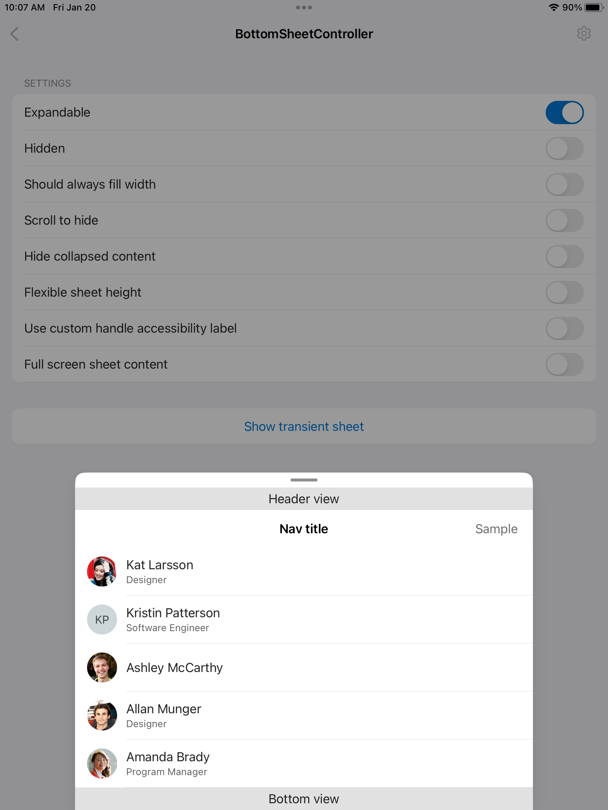

# Bottom Sheet
## Overview
`BottomSheet` is helpful for enabling a simple task that people can complete before returning to the parent view.



## Usage
### UIKit
```Swift
let bottomSheetController = BottomSheetController(headerContentView: headerContentView,
                                                  expandedContentView: expandedContentView,
                                                  shouldShowDimmingView: shouldShowDimmingView)
bottomSheetViewController.delegate = self
self.addChild(bottomSheetController)
view.addSubview(bottomSheetController.view)
bottomSheetController.didMove(toParent: self)
```
#### Parameters
 - headerContentView: Top part of the sheet content that is visible in both collapsed and expanded state.
 - expandedContentView: Sheet content below the header which is only visible when the sheet is expanded.
 - shouldShowDimmingView: Indicates if the main content is dimmed when the sheet is expanded.

#### Other Settings
 - hostedScrollView: A scroll view in `expandedContentView`'s view hierarchy. Provide this to ensure the bottom sheet pan gesture recognizer coordinates with the scroll view to enable scrolling based on current bottom sheet position and content offset.
 - isExpandable: Indicates if the bottom sheet is expandable.
 - isHidden: Indicates if the bottom sheet view is hidden. Changes to this property are animated. When hiding, new value is reflected after the animation completes.
 - isFlexibleHeight: Indicates if the sheet height is flexible. When set to `false`, the sheet height is static and always corresponds to the height of the maximum expansion state. Interacting with the sheet will only vertically translate it, moving it partially on/off-screen. When set to `true`, moving the sheet beyond the `.collapsed` state will resize it. Use flexible height if you have views attached to the bottom of `expandedContentView` that should always be visible.
 - headerContentHeight: Height of `headerContentView`. Setting this is required when the `headerContentView` is non-nil.
 - collapsedContentHeight: Height of the top portion of the content view that should be visible when the bottom sheet is collapsed. When set to 0, `headerContentHeight` will be used.
 - shouldHideCollapsedContent: Indicates if the content should be hidden when the sheet is collapsed
 - shouldAlwaysFillWidth: Indicates if the sheet should always fill the available width. The default value is `true`.
 - allowsSwipeToHide: When enabled, users will be able to move the sheet to the hidden state by swiping down.

### SwiftUI
There is currently no SwiftUI implementation of the `Bottom Sheet`

## Implementation
### Control Name
`BottomSheetController` in Swift, `MSFBottomSheetController` in Objective-C

### Source Code
 - [BottomSheetController.swift](https://github.com/microsoft/fluentui-apple/blob/main/ios/FluentUI/Bottom%20Sheet/BottomSheetController.swift)
 - [BottomSheetPassthroughView.swift](https://github.com/microsoft/fluentui-apple/blob/main/ios/FluentUI/Bottom%20Sheet/BottomSheetPassthroughView.swift)
 - [ContentHeightResolutionContext.swift](https://github.com/microsoft/fluentui-apple/blob/main/ios/FluentUI/Bottom%20Sheet/ContentHeightResolutionContext.swift)
 - [BottomSheetTokenSet.swift](https://github.com/microsoft/fluentui-apple/blob/main/ios/FluentUI/Bottom%20Sheet/BottomSheetTokenSet.swift)

### Sample Code
 - [BottomSheetDemoController.swift](https://github.com/microsoft/fluentui-apple/blob/main/ios/FluentUI.Demo/FluentUI.Demo/Demos/BottomSheetDemoController.swift)
