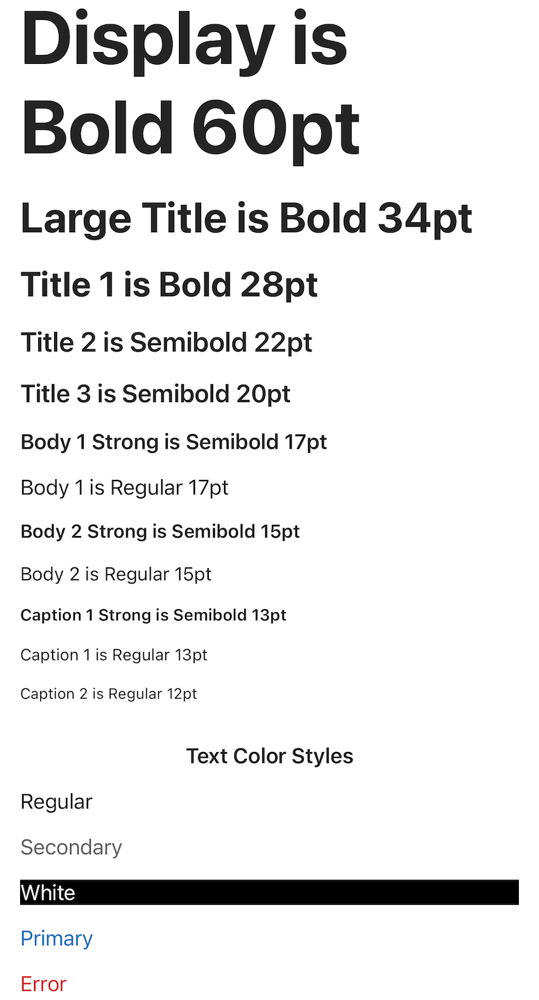

# Label
## Overview
Use `Label` to standardize text across your app.

The design tokens determining the font size and weight represent Apple's fundamental design element of [Typography](https://developer.apple.com/design/human-interface-guidelines/foundations/typography). These styles and colors can be customized with the `attributedText` and `maxFontSize` properties. If the device's [accessibility text size](https://developer.apple.com/design/human-interface-guidelines/foundations/accessibility/#text-display) is changed, the `Label` text size will adjust accordingly. The tokenized styles and colors of `Label` are pictured below.


## Usage
### UIKit
```Swift
// Label with tokenized style/color
let label = Label(textStyle: style, colorStyle: colorStyle)
label.text = text
label.numberOfLines = 0

// Label with custom style/color
let label = Label()
let attributedString = NSAttributedString(string: "This is a label with red Papyrus font attribute.",
                                          attributes: [.font: UIFont.init(name: "Papyrus", size: 30.0)!,
                                                       .foregroundColor: UIColor.red])
label.attributedText = attributedString
label.numberOfLines = 0
```
### SwiftUI
There is currently no SwiftUI implementation of the Label

## Implementation
### Control Name
`Label` in Swift, `MSFLabel` in Objective-C
### Source Code
[Label.swift](https://github.com/microsoft/fluentui-apple/blob/main/Sources/FluentUI_iOS/Components/Label/Label.swift)
### Sample Code
[LabelDemoController.swift](https://github.com/microsoft/fluentui-apple/blob/main/Demos/FluentUIDemo_iOS/FluentUI.Demo/Demos/LabelDemoController.swift)
