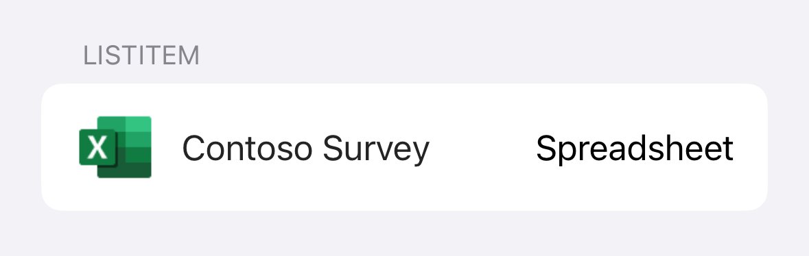

# ListItem

## Overview
`ListItem` can be used either in a [List](https://developer.apple.com/documentation/swiftui/list) or standalone to represent a single item within a vertical container. It can display a title, optional subtitle, optional footer, optional leading content view, and optional trailing content view. You can also customize the top and bottom separators, accessory type, and action. When an `action` parameter is passed in, `ListItem` will render as a `Button`. When `action` is nil or no `action` parameter is passed in, `ListItem` will render as a `View`.

| In a List | Standalone |
| - | - |
|  |  |

| Button | View |
| - | - |
|  |  |

### Accessory types
| None | Disclosure Indicator | Checkmark | Detail Button |
| - | - | - | - |
|   |  |  |  |

## Usage
```Swift
ListItem(title: "Title",
         subtitle: "Subtitle",
         leadingContent: {
             leadingContent
         },
         action: !isTappable ? nil : {
             showingAlert = true
         }
)
```

## Implementation
### Control Name
`ListItem` in SwiftUI

### Source Code
- [ListItem.swift](https://github.com/microsoft/fluentui-apple/blob/main/Sources/FluentUI_iOS/Components/List/ListItem.swift)

### Sample Code
- [ListItemDemoController_SwiftUI.swift](https://github.com/microsoft/fluentui-apple/blob/main/Demos/FluentUIDemo_iOS/FluentUI.Demo/Demos/ListItemDemoController_SwiftUI.swift)
