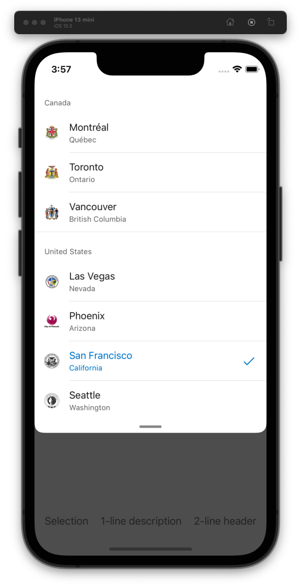
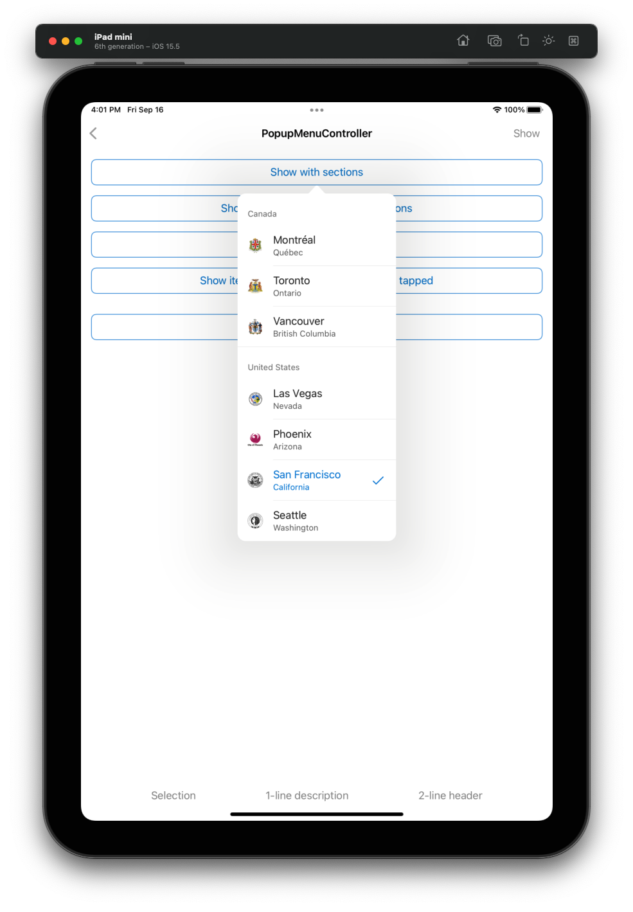

# PopupMenuController
## Overview
`PopupMenuController` is a `DrawerController` hosting a `UITableView`.
The `PopupMenuController` is shown as a sheet on iPhone, and a popover on iPad.
| iPhone | iPad |
|---|---|
|  |  |

## Usage
### UIKit
The `PopupMenuController` will render the provided `PopupMenuItem`s and `PopupMenuSection`s as a table
### SwiftUI
There is currently no SwiftUI implementation of the PopupMenuController

## Implementation
### Source Code
#### UIKit
 - [PopupMenuController.swift](https://github.com/microsoft/fluentui-apple/blob/main/ios/FluentUI/Popup%20Menu/PopupMenuController.swift)
 - [PopupMenuItem.swift](https://github.com/microsoft/fluentui-apple/blob/main/ios/FluentUI/Popup%20Menu/PopupMenuItem.swift)
 - [PopupMenuItemCell.swift](https://github.com/microsoft/fluentui-apple/blob/main/ios/FluentUI/Popup%20Menu/PopupMenuItemCell.swift)
 - [PopupMenuProtocols.swift](https://github.com/microsoft/fluentui-apple/blob/main/ios/FluentUI/Popup%20Menu/PopupMenuProtocols.swift)
 - [PopupMenuSection.swift](https://github.com/microsoft/fluentui-apple/blob/main/ios/FluentUI/Popup%20Menu/PopupMenuSection.swift)
 - [PopupMenuSectionHeaderView.swift](https://github.com/microsoft/fluentui-apple/blob/main/ios/FluentUI/Popup%20Menu/PopupMenuSectionHeaderView.swift)
### Sample Code
#### Objective-C
 - [PopupMenuObjCDemoController.m](https://github.com/microsoft/fluentui-apple/blob/main/ios/FluentUI.Demo/FluentUI.Demo/Demos/PopupMenuObjCDemoController.m)
#### Swift
 - [PopupMenuDemoController.swift](https://github.com/microsoft/fluentui-apple/blob/main/ios/FluentUI.Demo/FluentUI.Demo/Demos/PopupMenuDemoController.swift)