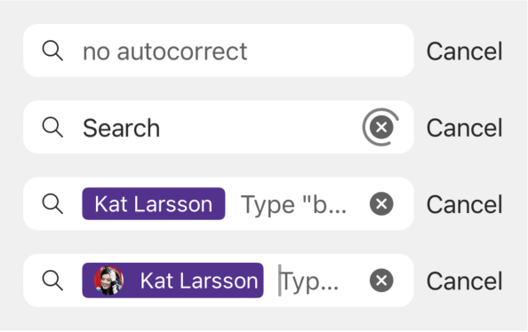
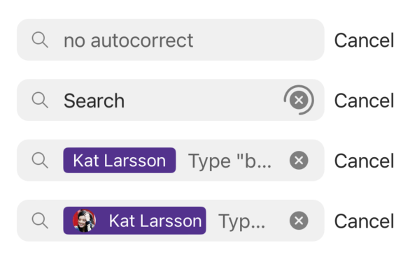
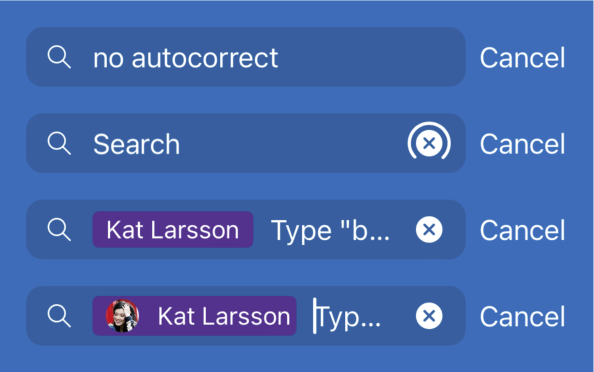

# SearchBar
## Overview
A rectangular view, typically used in a navigation bar, that accepts typed-in text in order to look up something or launch a search.
The `SearchBar` contains a search icon, a search text field, a placeholder text, a clear icon, and a cancel icon.

### Styles
| | Style |
|---|---|
| On Canvas |  |
| On System |  |
| On Brand |  |

## Usage
### UIKit
```Swift
    let searchBar = SearchBar(frame: .zero)
    searchBar.delegate = self
    searchBar.style = .onCanvas
    searchBar.placeholderText = "Search"
    searchBar.hidesNavigationBarDuringSearch = false
    searchBar.autocorrectionType = autocorrectionType
```

## Implementation
### Control Name
`SearchBar` in Swift, `MSFSearchBar` in Objective-C

### Source Code
- [SearchBar.swift](https://github.com/microsoft/fluentui-apple/blob/main/ios/FluentUI/Navigation/SearchBar/SearchBar.swift)

### Sample Code
- [SearchBarDemoController.swift](https://github.com/microsoft/fluentui-apple/blob/main/ios/FluentUI.Demo/FluentUI.Demo/Demos/SearchBarDemoController.swift)

## Accessibility
`SearchBar` publicly exposes accessibility hints, labels and identifiers for the `clearButton`, `cancelButton`, and `searchTextField`.
