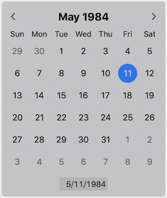
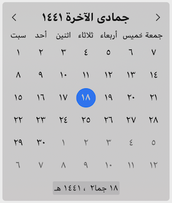
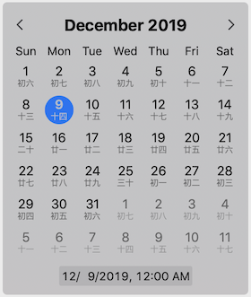
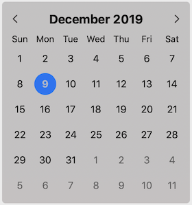

# Date Picker

## Overview
The DatePicker component enables a user to quickly pick a date and time. It uses the provided `Calendar` instance as a data source. If no calendar is provided, it uses `Calendar.current`, which is the system calendar.

## Best Practices
### Do
- Always display the date picker with edge padding. You can either use the built-in `hasEdgePadding` property, or keep it `false` and apply padding in your own view hierarchy.
- Choose a contrasting background / selection color combination to help readability.
- Use the built-in text field if you need text input.
- Verify that keyboard navigation works properly in your scenario.

### Don't
- Force the underlying view to be a certain size.

## Usage
```Swift
// Default configuration with date and time text field
DatePickerController(date: nil, 
                     calendar: nil, 
                     style: .dateTime)
```


```Swift
// Default configuration with date-only text field
DatePickerController(date: nil, 
                     calendar: nil, 
                     style: .date)
```


```Swift
// Custom initial date
let date = Calendar.current.date(from: DateComponents(year: 1984, month: 5, day: 11))
DatePickerController(date: date, 
                     calendar: nil, 
                     style: .date)
```


```Swift
// Custom calendar
var calendar = Calendar(identifier: .islamic)
calendar.locale = Locale(identifier: "ar")
DatePickerController(date: nil, 
                     calendar: calendar, 
                     style: .date)
```


```Swift
// Secondary Calendar
var calendar = Calendar.init(identifier: .chinese)
calendar.locale = Locale(identifier: "zh")
let controller = DatePickerController(date: nil, 
                                      calendar: nil, 
                                      style: .dateTime)
controller.secondaryCalendar = calendar
```


```Swift
// No text field
let controller = DatePickerController(date: nil, 
                                      calendar: nil, 
                                      style: .dateTime)
controller.hasTextField = false
```



## Implementation
### Control Name
`DatePickerController` in Swift, `MSFDatePickerController` in Objective-C
### Source Code
[DatePickerController.swift](https://github.com/microsoft/fluentui-apple/blob/main/Sources/FluentUI_macOS/Components/DatePicker/DatePickerController.swift)
### Sample Code
[TestDatePickerController.swift](https://github.com/microsoft/fluentui-apple/blob/main/Demos/FluentUIDemo_macOS/FluentUITestViewControllers/TestDatePickerController.swift)
