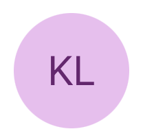
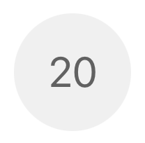
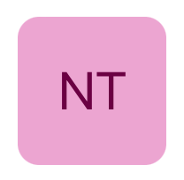

# Avatar

## Overview
`Avatar` is a graphical representation of a user, team, or entity. It can display an image, icon, or initials, and can be either circular or square.

The different variations of `Avatar` are pictured below.

#### Circle
| Image | Initials | Icon | Accent Icon | Outline Icon | Outlined Primary Icon | Overflow |
| - | - | - | - | - | - | - |
|  |  |  |  |  |  |  |

#### Square
| Image | Initials |
| - | - |
|  |  |

## Usage
### UIKit
```Swift
let avatar = MSFAvatar(style: avatarStyle,
                       size: avatarSize)
let avatarState = avatar.state
avatarState.primaryText = avatarPrimaryText
avatarState.image = avatarImage
```

### SwiftUI
```Swift
Avatar(style: style,
       size: size,
       image: image,
       primaryText: primaryText,
       secondaryText: secondaryText)
```

## Implementation
### Control Name
`Avatar` in Swift, `MSFAvatar` in Objective-C

### Source Code
- [Avatar.swift](https://github.com/microsoft/fluentui-apple/blob/main/ios/FluentUI/Avatar/Avatar.swift)
- [MSFAvatar.swift](https://github.com/microsoft/fluentui-apple/blob/main/ios/FluentUI/Avatar/MSFAvatar.swift)

### Sample Code
- [AvatarDemoController.swift](https://github.com/microsoft/fluentui-apple/blob/main/ios/FluentUI.Demo/FluentUI.Demo/Demos/AvatarDemoController.swift)
- [AvatarDemoController_SwiftUI.swift](https://github.com/microsoft/fluentui-apple/blob/main/ios/FluentUI.Demo/FluentUI.Demo/Demos/AvatarDemoController_SwiftUI.swift)
