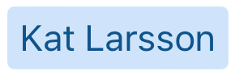
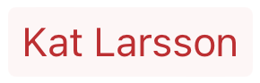
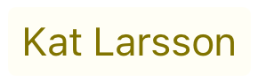
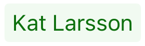
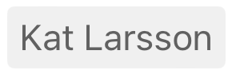
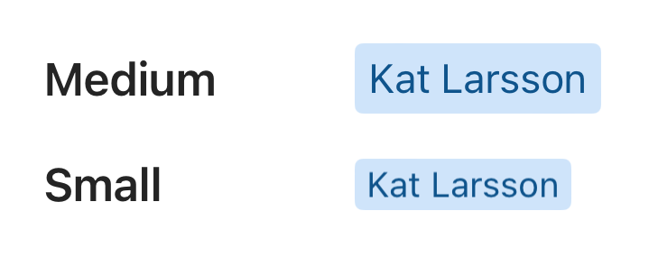

# BadgeView

## Overview
`BadgeView` is used to present text with a colored background in the form of a "badge". It is used in `BadgeField` to represent a selected item.

The different variations of `BadgeView` are pictured below.

#### Styles
| Brand | Danger | Severe Warning | Warning | Success | Neutral |
| - | - | - | - | - | - |
|  |  |  |  |  |  |

#### Disabled Styles
| Brand | Other |
| - | - |
|  |  |

#### Sizes


#### BadgeView with Custom View


## Usage
### UIKit
```Swift
let dataSource = BadgeViewDataSource(text: text)
let badge = BadgeView(dataSource: dataSource)
```
#### Parameters
 - text: Text to be displayed in the badge.
 - style: The style of the badge (Brand, Danger, Severe Warning, Warning, Success, Neutral).
 - size: The size of the badge (Small, Medium).
 
#### Other Settings
 - customView: A custom view that is displayed to the left of the text.
 - customViewVerticalPadding: Padding above and below the custom view.
 - customViewPaddingLeft: Padding to the left of the custom view.
 - customViewPaddingRight: Padding to the right of the custom view.
 
### SwiftUI
There is currently no SwiftUI implementation of the `BadgeView`

## Implementation
### Control Name
`BadgeView` in Swift, `MSFBadgeView` in Objective-C

### Source Code
- [BadgeView.swift](https://github.com/microsoft/fluentui-apple/blob/main/ios/FluentUI/Badge%20Field/BadgeView.swift)

### Sample Code
- [BadgeViewDemoController.swift](https://github.com/microsoft/fluentui-apple/blob/main/ios/FluentUI.Demo/FluentUI.Demo/Demos/BadgeViewDemoController.swift)

