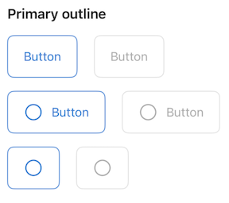
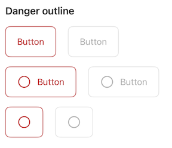
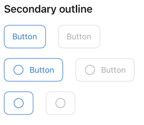
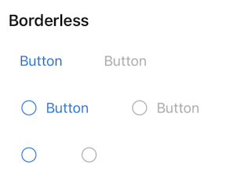

# Button
## Overview
A `Button` triggers a single action or event.
Use `Button`s for important actions like submitting a response, committing a change, or moving to the next step.

### Styles
| | Style |
|---|---|
| Primary filled |  |
| Primary outline |  |
| Danger filled |  |
| Danger outline |  |
| Secondary outline |  |
| Tertiary outline |  |
| Borderless |  |

## Usage
### UIKit
The `Button` can be initialized with a `ButtonStyle` parameter as follows:
```Swift
let button = Button(style: style)
```
### SwiftUI
There is currently no SwiftUI implementation of the `Button`

## Implementation
### Control Name
`Button` in Swift, `MSFButton` in Objective-C

### Source Code
 - [Button.swift](https://github.com/microsoft/fluentui-apple/blob/main/ios/FluentUI/Button/Button.swift)
 - [ButtonTokenSet.swift](https://github.com/microsoft/fluentui-apple/blob/main/ios/FluentUI/Button/ButtonTokenSet.swift)
### Sample Code
 - [ButtonDemoController.swift](https://github.com/microsoft/fluentui-apple/blob/main/ios/FluentUI.Demo/FluentUI.Demo/Demos/ButtonDemoController.swift)

