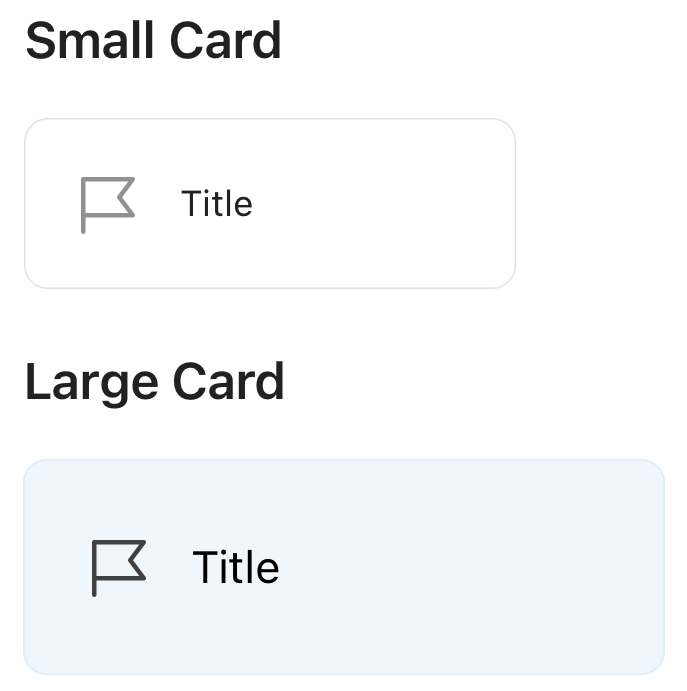
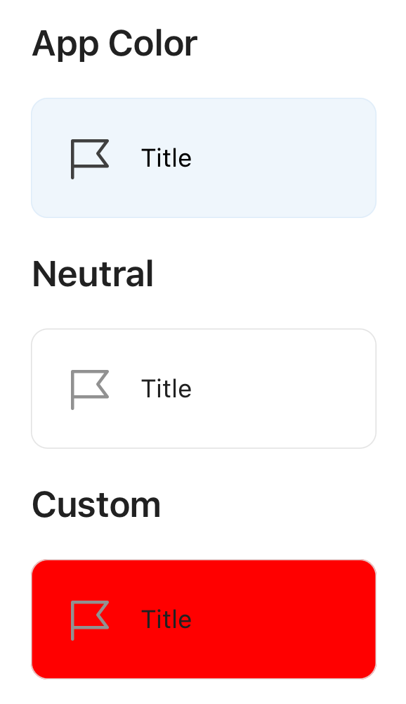

# Card

## Overview
The `Card` component is a framework for organizing content within the confines of a container. Its main function is to provide the scaffolding for hosting actions and content for a single topic within a card.

The different variations of `Card` are pictured below.

#### Circle
| Title Only | Title and Subtitle | Long Title | Long Title and Subtitle | Sizes | Styles |
| - | - | - | - | - | - |
|  |  |  |  |  |  |

## Usage
### UIKit
```Swift
let card = CardView(
    size: size,
    title: title,
    subtitle: subtitle,
    icon: icon,
    colorStyle: style)
```

### SwiftUI
There is currently no SwiftUI implementation of `Card`.

## Implementation
### Control Name
`Card` in Swift, `MSFCard` in Objective-C

### Source Code
[CardView.swift](https://github.com/microsoft/fluentui-apple/blob/main/ios/FluentUI/Card/CardView.swift)

### Sample Code
[CardViewDemoController.swift](https://github.com/microsoft/fluentui-apple/blob/main/ios/FluentUI.Demo/FluentUI.Demo/Demos/CardViewDemoController.swift)
