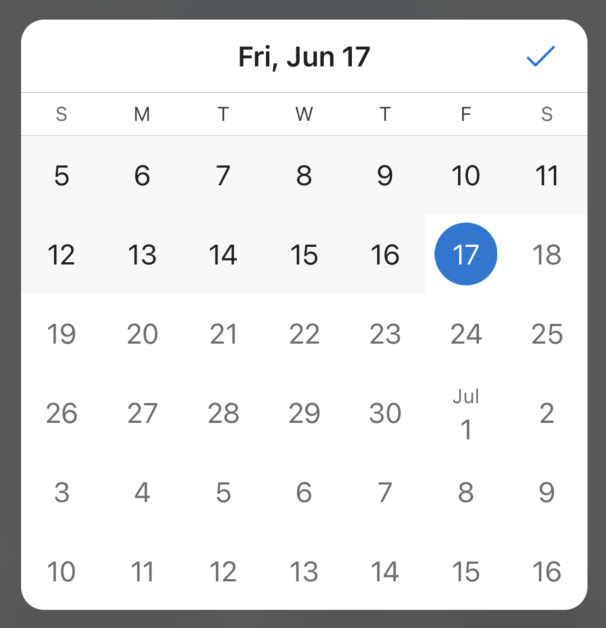
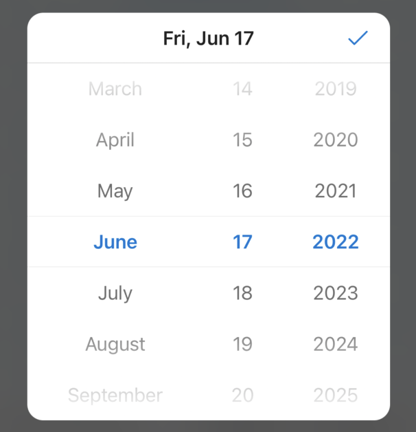
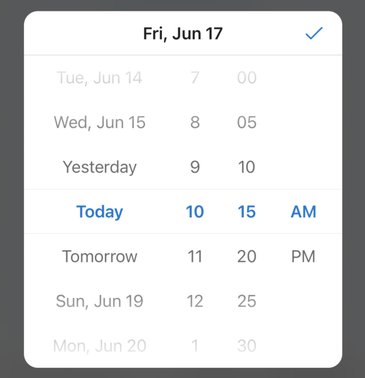
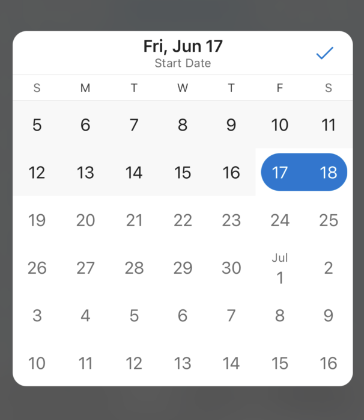
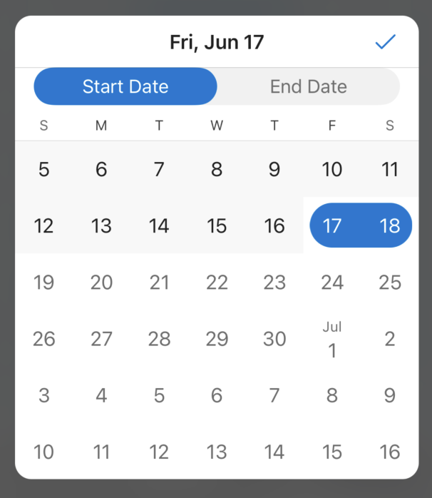
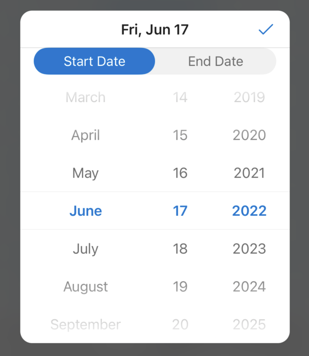
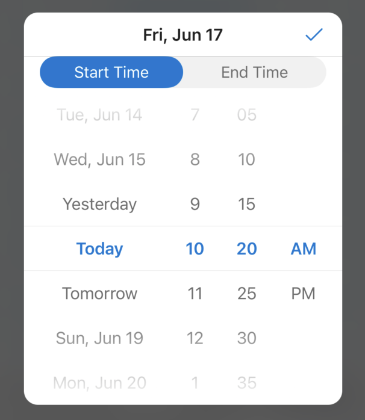

# Date Time Picker

## Overview
`DateTimePicker` is a control that faciliates the selection of dates and/or times.

There are variations of date pickers depending on the DateTimePickerMode, and DatePickerType

| | DatePickerType: `calendar`| | DatePickerType: `components`|
| - | - | - | - |
| DateTimePickerMode: `date` |  | |  |
| DateTimePickerMode: `dateTime` | Page 1:  | Page 2:  |  |
| DateTimePickerMode: `dateRange` | Paged version:  | Tabbed version:  |  |
| DateTimePickerMode: `dateTimeRange` |  | |  |

## Usage
```Swift
let dateTimePicker = DateTimePicker()
dateTimePicker.present(from: self,
                       with: .dateRange,
                       startDate: startDate,
                       endDate: endDate,
                       calendarConfiguration: calendarConfiguration,
                       datePickerType: .calendar,
                       dateRangePresentation: .tabbed,
                       titles: titles,
                       leftBarButtonItem: leftBarButtonItem,
                       rightBarButtonItem: rightBarButtonItem)
```

## Implementation
### Control Name
`DateTimePicker` in Swift, `MSFDateTimePicker` in Objective-C
### Source Code
[DateTimePicker.swift](https://github.com/microsoft/fluentui-apple/blob/main/ios/FluentUI/Date%20Time%20Pickers/DateTimePicker.swift)
### Sample Code
[DateTimePickerDemoController.swift](https://github.com/microsoft/fluentui-apple/blob/main/ios/FluentUI.Demo/FluentUI.Demo/Demos/DateTimePickerDemoController.swift)

## Known Issues
### Custom Calendar Configuration
- By passing in a custom calendar configuration, the first day of the week (ex. Sunday, Monday) and the range of shown dates can be modified. The default calendar configuration has Sunday as the first day of the week, and provides a range of dates spanning 10 years, starting 3 years before the current date.
- Passing in a given reference start and end date will always ensure that the range of possible dates that can be selected will include the reference start and end date; however, for certain date pickers it is **not** guaranteed that dates outside of the range of reference start/end date cannot be selected.
  - Ex. when the given picker type is `components`, only the `year` component (ex. '2021', '2022') and the `date` component (ex. 'Fri, Jun 17') will restrict values based on the reference start/end dates. The `day` (ex. '12', '31') or `month` (ex. 'July', 'August') components, when shown, will not be restricted.
  - Ex. when the given picker mode is a `dateRange`, an end date past the given range of reference dates can be selected. Whatever range of dates was selected in the start date picker, will be kept when selecting the end date. So, if the range of selected days is 7 days, and then the selected start date gets moved to the last possible date, the end date will be out of the range of possible dates.
