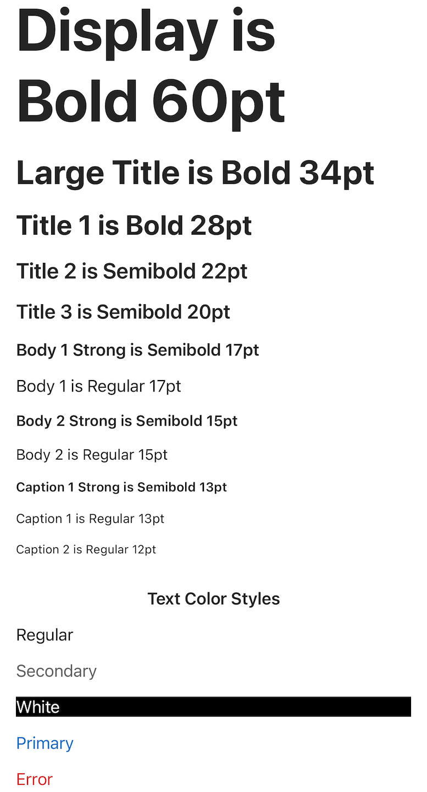

# Label
## Overview
Use `Label` to standardize text across your app.

The different styles and colors of `Label` are pictured below. These styles and colors can be customized with the `attributedText` and `maxFontSize` properties. If the device's accessibility text size is changed, the `Label` text size will adjust accordingly.


## Usage
### UIKit
```Swift
        // Label with tokenized style/color
        let label = Label(style: style, colorStyle: colorStyle)
        label.text = text
        label.numberOfLines = 0

        // Label with custom style/color
        let label = Label()
        let attributedString = NSAttributedString(string: "This is a label with red Papyrus font attribute.",
                                                  attributes: [.font: UIFont.init(name: "Papyrus", size: 30.0)!,
                                                               .foregroundColor: UIColor.red])
        label.attributedText = attributedString
        label.numberOfLines = 0
```
### SwiftUI
There is currently no SwiftUI implementation of the Label

## Implementation
### Control Name
`Label` in Swift, `MSFLabel` in Objective-C
### Source Code
[Label.swift](https://github.com/microsoft/fluentui-apple/blob/main/ios/FluentUI/Label/Label.swift)
### Sample Code
[LabelDemoController.swift](https://github.com/microsoft/fluentui-apple/blob/fluent2-tokens/ios/FluentUI.Demo/FluentUI.Demo/Demos/LabelDemoController.swift)
