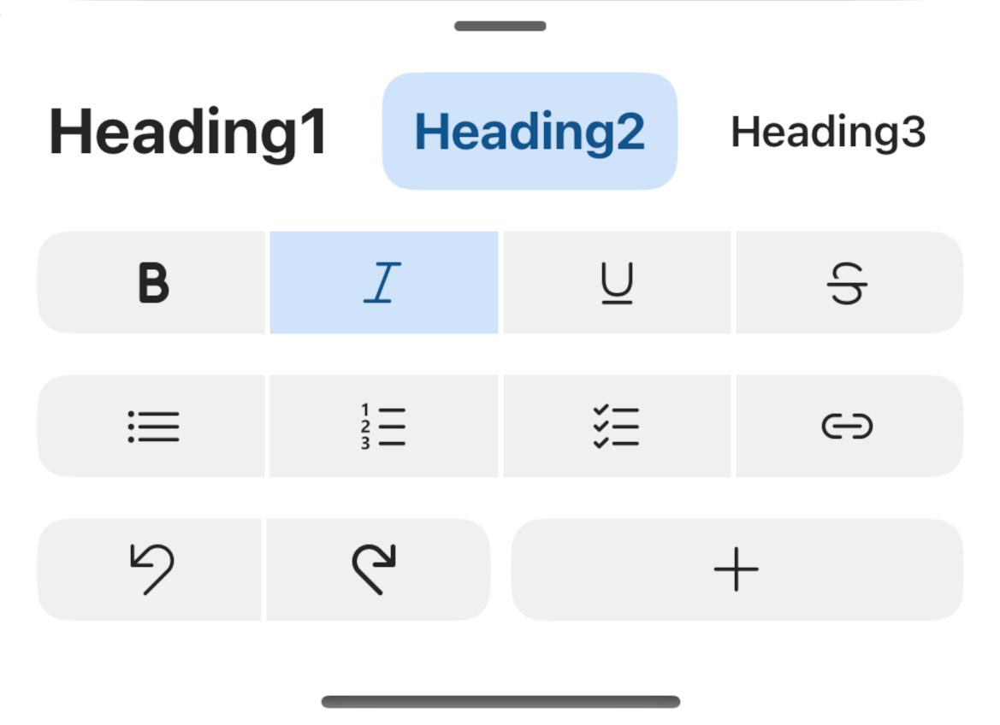

# Multiline Command Bar

## Overview
`MultilineCommandBar` is a vertical list of `CommandBars`, hosted in a `BottomSheetController`.

| Compact Mode | Regular Mode |
| - | - |
|  |  |

## Usage
### UIKit
```Swift
let compactRows: [MultilineCommandBarRow] = [
    MultilineCommandBarRow(itemGroups: itemGroups, isScrollable: true)
]
let regularRows: [MultilineCommandBarRow] = [
    MultilineCommandBarRow(itemGroups: itemGroups)
]
let multilineCommandBar = MultilineCommandBar(compactRows: compactRows, regularRows: regularRows)
```

## Implementation
### Control Name
`MultilineCommandBar` in Swift, `MSFMultilineCommandBar` in Objective-C

### Source Code
- [MultilineCommandBar.swift](https://github.com/microsoft/fluentui-apple/blob/main/ios/FluentUI/MultilineCommandBar/MultilineCommandBar.swift)

### Sample Code
- [MultilineCommandBarDemoController.swift](https://github.com/microsoft/fluentui-apple/blob/main/ios/FluentUI.Demo/FluentUI.Demo/Demos/MultilineCommandBarDemoController.swift)

## Accessibility
`MultilineCommandBar` contains accessibility identifiers for each `CommandBar`.
