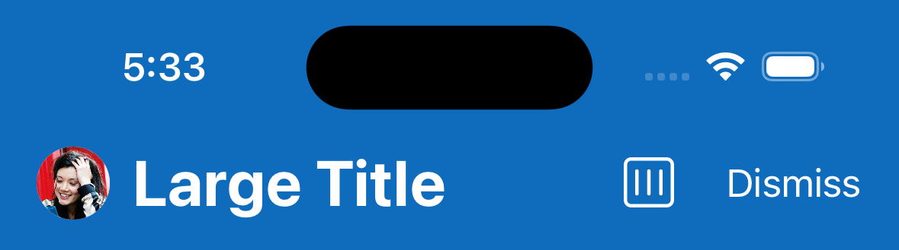
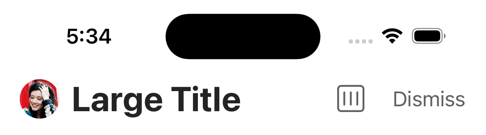
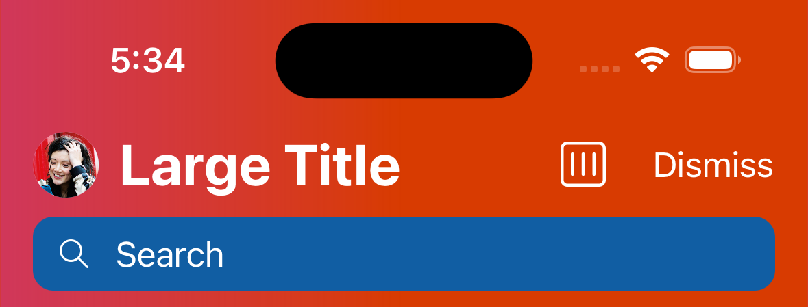
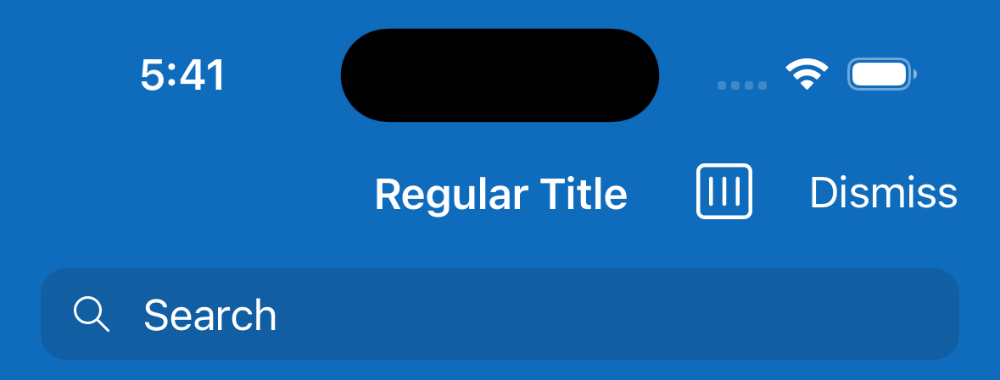
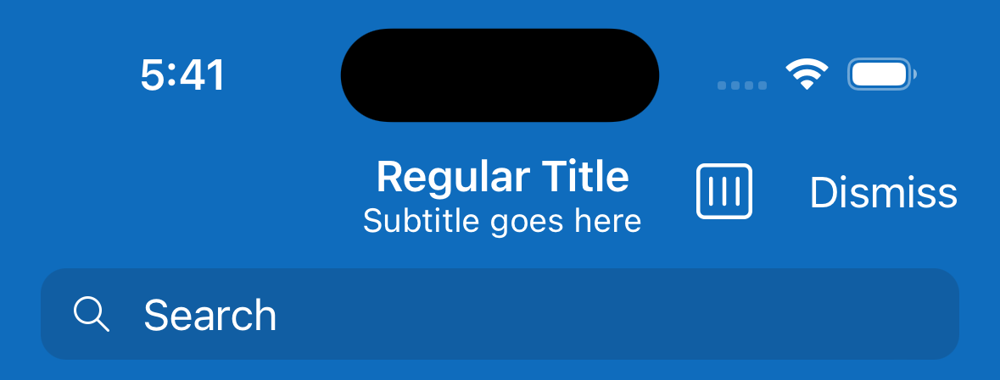
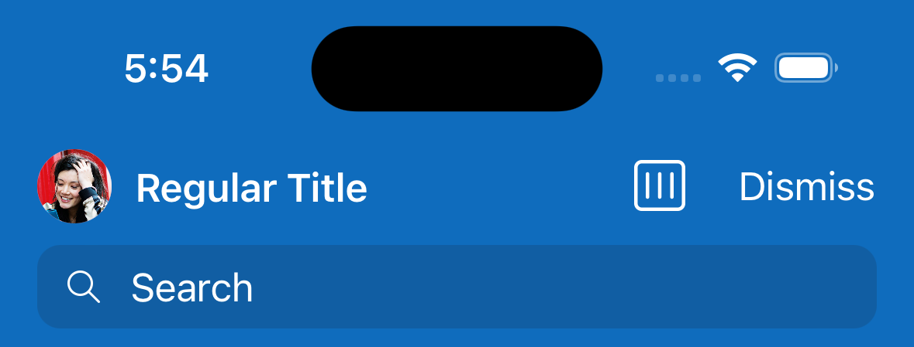
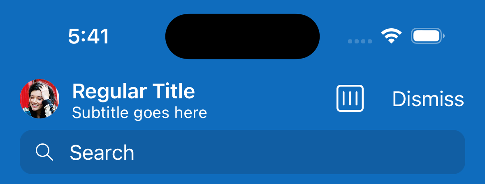
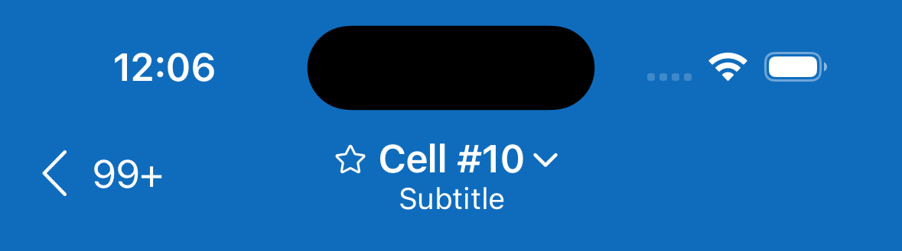
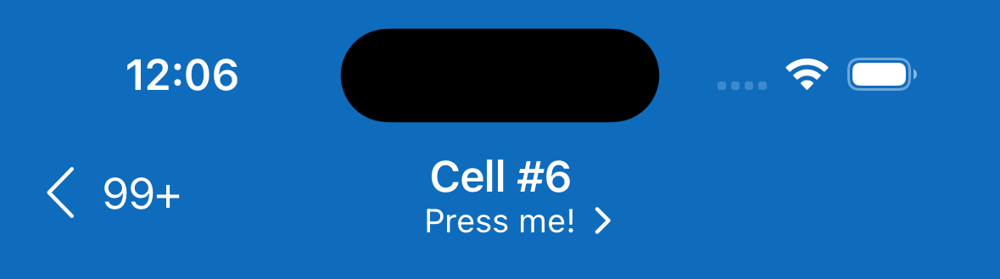

# Navigation

## Overview

Use a `NavigationController` to enable users to navigate through hierarchical data. `NavigationController`, along with [extensions to `UINavigationItem`](https://github.com/microsoft/fluentui-apple/blob/main/ios/FluentUI/Navigation/UINavigationItem%2BNavigation.swift), allow you to render all relevant information with a Fluent look and feel.

### Appearance Examples

| `NavigationBar.Style` | Example |
|-|-|
| `.primary` |  |
| `.system` |  |
| `.custom` |  |

| `NavigationBar.TitleStyle` | Example |
|-|-|
| `.system` |   |
| `.leading` |   |
| `.largeLeading` |  |

### More Customization Options

By specifying an appropriate instance of `NavigationBarTitleAccessory`, you can indicate to users that the title can be pressed.

You can also specify an optional `titleImage` with the associated navigation item.

| Specifications | Example |
|-|-|
| Title down arrow with `titleImage` | 
| Subtitle disclosure | 

## Implementation

### Source Code

[Navigation folder](https://github.com/microsoft/fluentui-apple/blob/main/ios/FluentUI/Navigation/)

### Sample Code

[NavigationControllerDemoController.swift](https://github.com/microsoft/fluentui-apple/blob/main/ios/FluentUI.Demo/FluentUI.Demo/Demos/NavigationControllerDemoController.swift)
