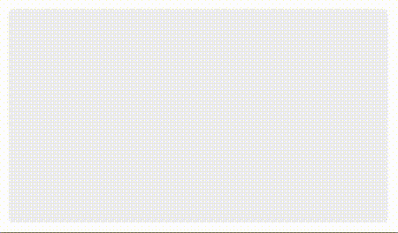
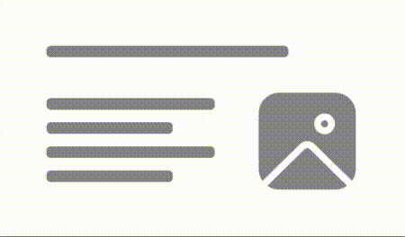

# Shimmer
## Overview
`Shimmer` is a temporary animation placeholder for when a service call takes time to return data but the rest of the UI should continue rendering.

There are variations of shimmers depending on the MSFShimmerStyle

| MSFShimmerStyle: `revealing`| MSFShimmerStyle: `concealing` |
| - | - |
|  |  |

## Usage
### Objective-C/UIKit
The Objective-C/UIKit implementation creates a shimmering `CAGradientLayer` to add over the container view.
``` Swift
let shimmerView = MSFShimmerView(containerView: containerView,
                                 excludedViews: [],
                                 animationSynchronizer: nil,
                                 shimmerStyle: .revealing,
                                 shimmersLeafViews: shimmersLeafViews,
                                 usesTextHeightForLabels: true)
```
##### Parameters
- containerView: view to convert layout into a shimmer -- each of containerView's first-level subviews will be mirrored.
- excludedViews: subviews of `containerView` to exclude from shimmer.
- animationSynchronizer: optional synchronizer to sync multiple shimmer views.
- shimmerStyle: determines whether the shimmer is a revealing shimmer or a concealing shimmer.
- shimmersLeafViews: True to enable shimmers to auto-adjust to font height for a UILabel -- this will more accurately reflect the text in the label rect rather than using the bounding box.
- usesTextHeightForLabels: Determines whether we shimmer the top level subviews, or the leaf nodes of the view hierarchy. If false, we use default height of 11.0.

### SwiftUI
The SwiftUI implementation is a ViewModifier that adds a shimmering effect to the view being modified.
```Swift
Text("This is a single label being shimmered.")
    .shimmering(style: .revealing,
                shouldAddShimmeringCover: true,
                usesTextHeightForLabels: false,
                animationId: namespace,
                isLabel: true,
                isShimmering: true)
```
##### Parameters
- style: `MSFShimmerStyle` enum value that defines the style of the Shimmer being presented.
- shouldAddShimmeringCover: Determines whether the view itself is shimmered or an added cover on top is shimmered.
- usesTextHeightForLabels: Whether to use the height of the view (if the view is a label), else default to token value.
- animationId: When displaying one or more shimmers, this ID will synchronize the animations.
- isLabel: Whether the view is a label or not.
- isShimmering: Whether the shimmering effect is active.

## Implementation
### Control Name
`ShimmerView` in Swift, `MSFShimmerView` in Objective-C/UIKit
### Source Code
#### Objective-C/UIKit
[MSFShimmerView.swift](https://github.com/microsoft/fluentui-apple/blob/fluent2-tokens/ios/FluentUI/Shimmer/MSFShimmerView.swift)
#### SwiftUI
[ShimmerView.swift](https://github.com/microsoft/fluentui-apple/blob/fluent2-tokens/ios/FluentUI/Vnext/Shimmer/ShimmerView.swift)
[ShimmerModifiers.swift](https://github.com/microsoft/fluentui-apple/blob/fluent2-tokens/ios/FluentUI/Vnext/Shimmer/ShimmerModifiers.swift)
### Sample Code
#### Objective-C/UIKit
[ShimmerLinesViewDemoController.swift](https://github.com/microsoft/fluentui-apple/blob/fluent2-tokens/ios/FluentUI.Demo/FluentUI.Demo/Demos/ShimmerLinesViewDemoController.swift)
#### SwiftUI
[ShimmerLinesViewDemoController_SwiftUI.swift](https://github.com/microsoft/fluentui-apple/blob/fluent2-tokens/ios/FluentUI.Demo/FluentUI.Demo/Demos/ShimmerLinesViewDemoController_SwiftUI.swift)
