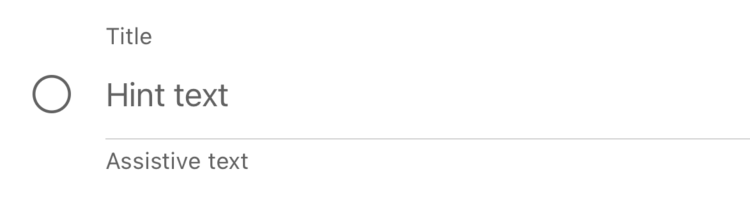

# Text Field
## Overview
The Fluent Text Field is a UIView containing a UITextField, a Separator, and optionally a leading UIImage, a title Label, and an assistive text Label. 

## Usage

When at rest with no input text, the Text Field will show the placeholder text.



Once the user selects the Text Field, it recolors the leading image, title, and separator with brand colors to show that it has focus. The Text Field will also show the trailing clear text button while it has focus.


The user can then start typing in that Text Field.


Once the user is done and taps away, the Text Field will switch back to the unfocused state with neutral colors, but will continue to show the trailing clear text button as long as the input text isn't nil.


The Text Field also exposes an optional [FluentTextInputError](https://github.com/microsoft/fluentui-apple/blob/main/ios/FluentUI/TextField/FluentTextInputError.swift), which if set will replace the assistive text with the error's localized description and will recolor the title, separator, and assistive text to show that it is in the error state.


The Text Field has four closure properties that allow clients to respond to specific events from the UITextField:
``` Swift
    /// The closure for the action to be called in response to the textfield's `.editingChanged` event.
    @objc public var onEditingChanged: ((FluentTextField) -> Void)?

    /// The closure for the action to be called in `textFieldDidBeginEditing`.
    @objc public var onDidBeginEditing: ((FluentTextField) -> Void)?

    /// The closure for the action to be called in `textFieldDidEndEditing`.
    @objc public var onDidEndEditing: ((FluentTextField) -> Void)?

    /// The closure for the action to be called in `textFieldShouldReturn`. The return value of `onReturn`
    /// will be returned in `textFieldShouldReturn`.
    @objc public var onReturn: ((FluentTextField) -> Bool)?
```

The UITextField that the Text Field uses is actually a custom subclass of the UITextField, the [FluentTextFieldInternal](https://github.com/microsoft/fluentui-apple/blob/main/ios/FluentUI/TextField/FluentTextFieldInternal.swift), so that the position of the trailing clear text button could be customized.

## Implementation
### Control Name
`FluentTextField` in Swift, `MSFTextField` in Objective C.

### Source Code
#### UIKit
 - [FluentTextField.swift](https://github.com/microsoft/fluentui-apple/blob/main/ios/FluentUI/TextField/FluentTextField.swift)
 - [TextFieldTokenSet.swift](https://github.com/microsoft/fluentui-apple/blob/main/ios/FluentUI/TextField/TextFieldTokenSet.swift)
 
### Sample Code
#### Objective-C
 - [TextFieldObjCDemoController.m](https://github.com/microsoft/fluentui-apple/blob/main/ios/FluentUI.Demo/FluentUI.Demo/Demos/TextFieldObjCDemoController.m)
 
#### Swift
 - [TextFieldDemoController.swift](https://github.com/microsoft/fluentui-apple/blob/main/ios/FluentUI.Demo/FluentUI.Demo/Demos/TextFieldDemoController.swift)
