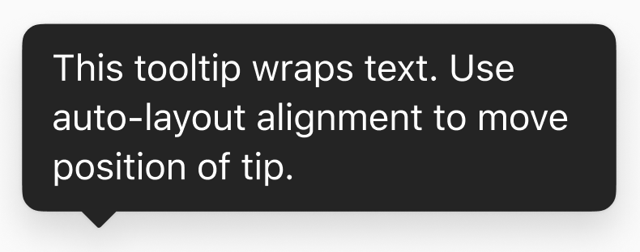
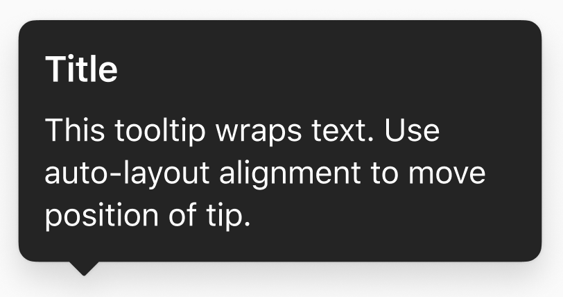
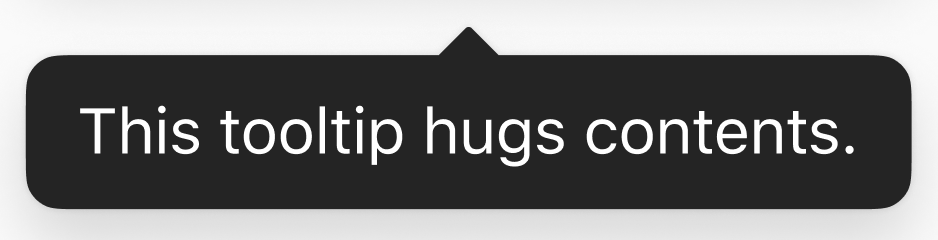
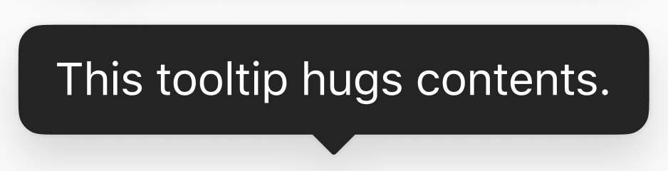
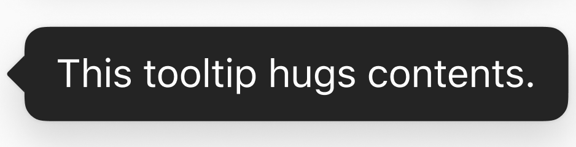
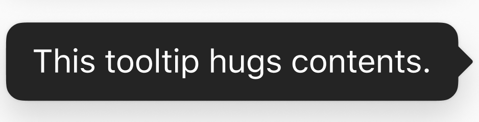

# Tooltip
## Overview
Use tooltips to show small unobtrusive hints on top of your app's UI. These can appear as a result of user interaction, or be triggered thoughtfully to assist the user in learning the details of a new feature they have shown interest in.

Variations: The tooltip can have an optional title and the tip of the tooltip can point up, down, left, or right.

#### Text
| Message Only | Message and Title |
| - | - |
|  |  |

#### Tooltip Direction
| Up | Down | Left | Right |
| - | - | - | - |
|  |  |  |  |

## Usage
Displays a tooltip based on the current settings, pointing to the supplied anchorView. If another tooltip view is already showing, it will be dismissed and the new tooltip will be shown.
``` Swift
Tooltip.shared.show(with: "This is the message of the tooltip.",
		    title: "This is the title of the tooltip.",
		    for: sender,
		    preferredArrowDirection: .up,
		    offset: CGPoint(x: 0, y: 0),
		    dismissOn: .tapAnywhere,
		    onTap: { /* Action after Tapping */ })
```
##### Parameters
- message: The text to be displayed on the new tooltip view.
- title: The optional bolded text to be displayed above the message on the new tooltip view.
- anchorView: The view to point to with the new tooltip’s arrow.
- preferredArrowDirection: The preferred direction for the tooltip’s arrow. Only the arrow’s axis is guaranteed; the direction may be changed based on available space between the anchorView and the screen’s margins. Defaults to down.
- offset: An offset from the tooltip’s default position.
- dismissMode: The mode of tooltip dismissal. Defaults to tapping anywhere.
- onTap: An optional closure used to do work after the user taps.

## Implementation
### Control Name
`Tooltip` in Swift, `MSFTooltip` in Objective-C/UIKit
### Source Code
[Tooltip.swift](https://github.com/microsoft/fluentui-apple/blob/fluent2-tokens/ios/FluentUI/Tooltip/Tooltip.swift)  
[TooltipPositioner.swift](https://github.com/microsoft/fluentui-apple/blob/fluent2-tokens/ios/FluentUI/Tooltip/TooltipPositioner.swift)  
[TooltipView.swift](https://github.com/microsoft/fluentui-apple/blob/fluent2-tokens/ios/FluentUI/Tooltip/TooltipView.swift)
### Sample Code
[TooltipDemoController.swift](https://github.com/microsoft/fluentui-apple/blob/fluent2-tokens/ios/FluentUI.Demo/FluentUI.Demo/Demos/TooltipDemoController.swift)
