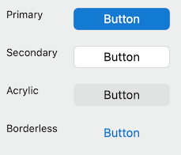
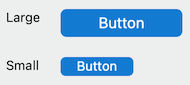
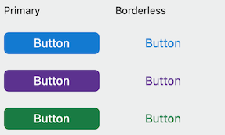
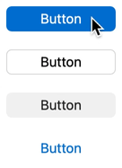
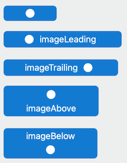

# Button

## Overview
Buttons are one of the core controls for any app.  Fluent buttons blend design cues from macOS with our own design language, to help the user feel at home on macOS and keep the experience quality high.


Buttons are a standard control that users can interact with to take actions within your application.

## Usage
### Style
There are four button styles, the default being .primary:
```Swift
let primaryButton = Button(title: "Button", style: .primary)
let secondaryButton = Button(title: "Button", style: .secondary)
let acrylicButton = Button(title: "Button", style: .acrylic)
let borderlessButton = Button(title: "Button", style: .borderless)
```


### Size
There are two button sizes, the default being .large:
```Swift
let largeButton = Button(title: "Button", size: .large)
let smallButton = Button(title: "Button", size: .small)
```


### Accent Color
The accent color of a button can be adjusted, the default being the app's primary color.  The accent color determines the background color of primary buttons, the pressed color of secondary buttons, and the text color of borderless buttons.  It has no effect on acrylic buttons.
```Swift
let largeButton = Button(title: "Button", accentColor: Colors.Palette.communicationBlue.color)
let smallButton = Button(title: "Button", accentColor: Colors.primary)
```


### Format: All of the Above
In Swift only, the style, size and accentColor can be combined into a single "format" property for convenience.
```Swift
let myFormat = ButtonFormat(size: .small, style: .borderless, accentColor: Colors.Palette.blueMagenta30.color)
let newButton = Button(title: "Button", format: myFormat)
oldButton.format = myFormat
```

### Linked Primary Button
When a Button is pressed, if it has a linkedPrimary Button, it will temporarily apply its format to the linkedPrimary.  This mimics the effect of native macOS secondary buttons taking the accent color highlighting from a nearby primary button when pressed.
```Swift
primaryButton = Button(title: "OK")
secondaryButton = Button(title: "Cancel", style: .secondary)
secondaryButton.linkedPrimary = primaryButton
```


### Image and Title
You can display an image alongside, or instead of, a title.  By default, the image leads the title.
```Swift
let buttonWithTitleAndImage = Button(title: "Button", image: NSImage(named: NSImage.addTemplateName)!, imagePosition: .imageTrailing)
let buttonWithImage = Button(image: NSImage(named: NSImage.addTemplateName)!)
```


## Best Practices
### Things to do
- Make sure the label conveys a clear purpose of the button to the user.
- Describe the action the button will perform, ideally with a verb. Use concise, specific, self-explanatory labels, usually a single word.
- When using an image in a button, use a template image so that it takes on the style and color of the button.
- For best results when using the `linkedPrimary` property, the current button should have the `.secondary` style, the linked button should have the `.primary` style, and both buttons should have the same `accentColor`.

### Things to avoid
- Don't place the default focus on a button that performs a destructive action. Place the default focus on a button that performs a "safe" action instead (e.g "Cancel").
- Overriding the underlying NSButtonCell will result in undefined behavior. While this may fit your use case, take caution while doing so.
- Setting the contentTintColor property will result in undefined behavior.  Use the style and accentColor properties to determine the look of the button instead.

## Implementation
### Control Name
`Button` in Swift, `MSFButton` in Objective-C
### Source Code
[Button.swift](https://github.com/microsoft/fluentui-apple/blob/main/macos/FluentUI/Button/Button.swift)
### Sample Code
[TestButtonViewController.swift](https://github.com/microsoft/fluentui-apple/blob/main/macos/FluentUITestViewControllers/TestButtonViewController.swift)
