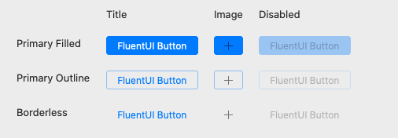

# Button

## Overview
Buttons are one of the core controls that make an app feel native to the platform it's on. It’s important to respect the platform's paradigms in order to help the user feel at home on macOS and keep the experience quality high.



Buttons are a standard control that users can interact with to take actions within your application. The FluentUI button for macOS adds system appropriate hover effects when your mouse rests over it.

## Best Practices
### Do
- Make sure the label conveys a clear purpose of the button to the user.
- Describe the action the button will perform, ideally with a verb. Use concise, specific, self-explanatory labels, usually a single word.

### Don't
- Place the default focus on a button that performs a destructive actionn. Instead, place the default focus on the button that performs the "safe action" (e.g "Cancel").

## Usage
```Swift
// There are 3 styles to choose from, the default being primary filled
let primaryFilledButton = Button(title: "FluentUI Button", style: .primaryFilled),
let primaryOutlineButton = Button(title: "FluentUI Button", style: .primaryOutline),
let borderlessButton = Button(title: "FluentUI Button", style: .borderless)
```

```Swift
// You can display an image instead of a title
let buttonWithImageAndStyle = Button(image: NSImage(named: NSImage.addTemplateName)!, style: .primaryFilled)
```
### Not recommended
- Overriding the underlying NSButtonCell will result in undefined behavior. While this may fit your use case, take caution while doing so.
- Displaying both a title and an image currently does not render properly, and is not recommended.

## Implementation
### Control Name
`Button` in Swift, `MSFButton` in Objective-C
### Source Code
[Button.swift](https://github.com/microsoft/fluentui-apple/blob/master/macos/FluentUI/Button.swift)
### Sample Code
[TestButtonViewController.swift](https://github.com/microsoft/fluentui-apple/blob/master/macos/FluentUITestApp/TestButtonViewController.swift)