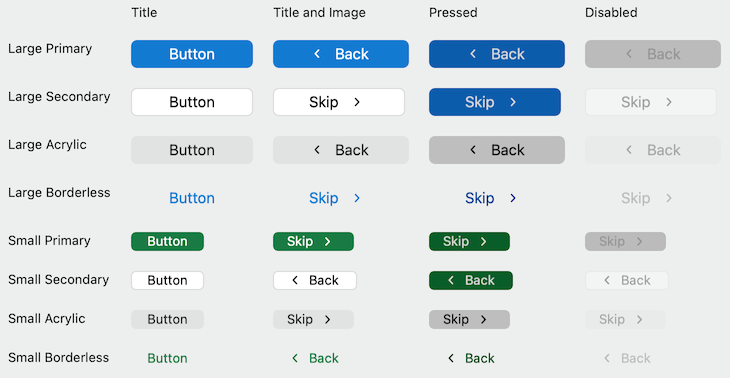

# Button

## Overview
Buttons are one of the core controls that make an app feel native to the platform it's on. It’s important to respect the platform's paradigms in order to help the user feel at home on macOS and keep the experience quality high.



## Best Practices
### Do
- Make sure the label conveys a clear purpose of the button to the user.
- Describe the action the button will perform, ideally with a verb. Use concise, specific, self-explanatory labels, usually a single word.

### Don't
- Place the default focus on a button that performs a destructive actionn. Instead, place the default focus on the button that performs the "safe action" (e.g "Cancel").


## Usage
```Swift
// There are 3 styles to choose from
let primaryFilledButton = Button(title: "FluentUI Button", style: .primaryFilled),
let primaryOutlineButton = Button(title: "FluentUI Button", style: .primaryOutline),
let BorderlessButton = Button(title: "FluentUI Button", style: .borderless),
```

```Swift
// You can set an image to ony display an image
let buttonWithImage = Button()
buttonWithImage.imagePosition = .imageOnly
buttonWithImage.image = NSImage(named: NSImage.addTemplateName)
```


## Implementation
### Control Name
`Button` in Swift, `MSFButton` in Objective-C
### Source Code
[Button.swift](https://github.com/microsoft/fluentui-apple/blob/master/macos/FluentUI/Button.swift)
### Sample Code
[TestButtonViewController.swift](https://github.com/microsoft/fluentui-apple/blob/master/macos/FluentUITestApp/TestButtonViewController.swift)