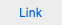
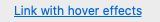

# Link

## Overview
With a Link, users can navigate to an external URL, or be overridden to perform a custom action. A link can be set to have an underline when the mouse hovers over it, or remove the underline completely to reduce visual clutter.

A Link is the lightest weight clickable control, and is often used to reduce the visual complexity of a design.


## Best Practices
### Do
- Use to navigate to an external URL, or open a help page
- Make Links discoverable by visual inspection alone. Users shouldn't have to interact with your program to find links.
- Use Links that give specific descriptive information about the result of clicking on the link, using as much text as necessary. Users should be able to - accurately predict the result of a link from its link text.


### Don't
- Use a link where a button would be better suited. Links should be used to navigate to webpages. For most other actions (e.g navigation internal to your app), a button is better suited than a link with an overridden action.
- Use if the action is destructive or irreversible. Because users associate links with navigation (and the ability to back out), Links aren't appropriate for commands with significant consequences.

## Usage

```Swift
// Given a title and URL, `Link` will by default open the URL in a web browser.
let link = Link(title: "Link", url: NSURL(string: "https://github.com/microsoft/fluentui-apple")!)
```


```Swift
// Link can also display an underline when a mouse hovers over it with the optional property "showsUnderlineWhileMouseInside".
let link = Link(title: "Link  with hover effects", url: NSURL(string: "https://github.com/microsoft/fluentui-apple")!)
link.showsUnderlineWhileMouseInside = true
```


```Swift
// Because Link is a subclass of NSControl, we can override the target/action to perform a custom task
let link = Link(title: "Link with overridden Target/Action")
link.showsUnderlineWhileMouseInside = true
link.target = self
link.action = #selector(displayAlert)

@objc private func displayAlert() {
    let alert = NSAlert()
    alert.messageText = "Alert"
    alert.informativeText = "This is an alert generated by a Link with an overridden Target/Action"
    alert.runModal()
}
```

## Implementation
### Control Name
`Link` in Swift, `MSFLink` in Objective-C
### Source Code
[Link.swift](https://github.com/microsoft/fluentui-apple/blob/main/macos/FluentUI/Link/Link.swift)
### Sample Code
[TestLinkViewController.swift](https://github.com/microsoft/fluentui-apple/blob/main/macos/FluentUITestViewControllers/TestLinkViewController.swift)
