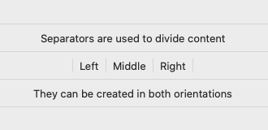

# Separator

## Overview
A separator visually separates content into groups.



## Best Practices
### Do
- Use separators sparingly to divide content into logical groups

### Don't
- Use many separators to recreate a table, where an NSTableView or similar may be more suitable.

## Usage
```Swift
// Separators can be created in two orientations
let verticalSeparator = Separator(orientation: .vertical)
let horizontalSeparator = Separator(orientation: .horizontal)

```

## Implementation
### Control Name
`Separator` in Swift, `MSFSeparator` in Objective-C
### Source Code
[Separator.swift](https://github.com/microsoft/fluentui-apple/blob/main/macos/FluentUI/Separator.swift)
### Sample Code
[TestSeparatorViewController.swift](https://github.com/microsoft/fluentui-apple/blob/main/macos/FluentUITestApp/TestSeparatorViewController.swift)